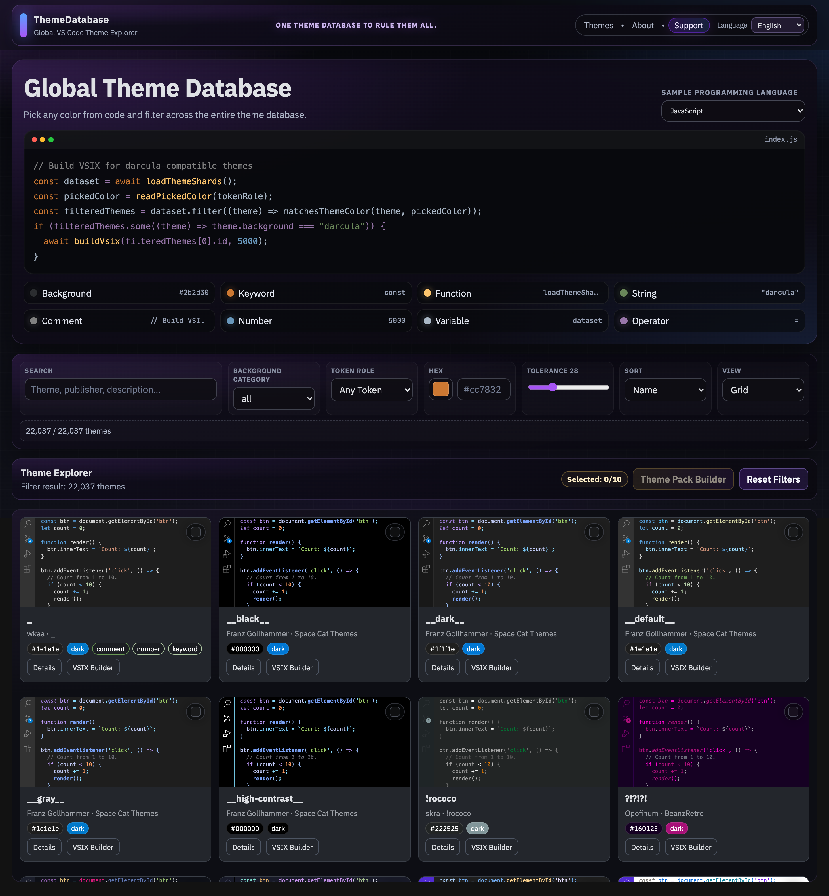
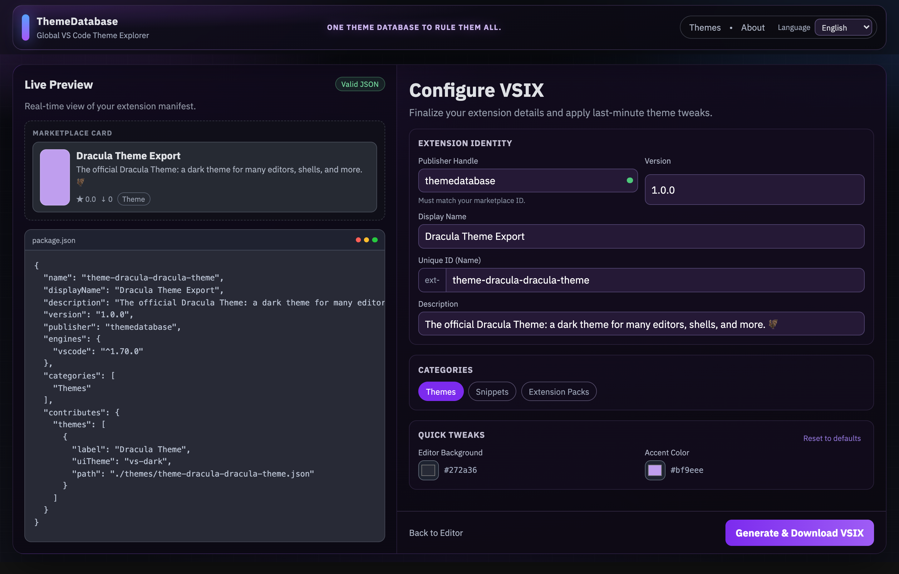

# ThemeDatabase

One Theme Database to rule them all.

ThemeDatabase is a static GitHub Pages app for exploring 22K+ VS Code themes, filtering by color and token intent, and exporting any theme as a `.vsix` extension package in the browser.

## Screenshots

Home (interactive color picker + filters):



VSIX Builder (generate and download extension package):



## Core Features

- Interactive code preview: click any syntax token color to filter the whole dataset.
- Color palette + HEX picker: presets, custom picker, and tolerance slider.
- Theme Explorer: virtualized grid/list browsing for large datasets.
- Theme Detail: palette breakdown, editor colors, and similar themes.
- VSIX Builder: validate metadata and generate a downloadable `.vsix` (JSZip, client-side).
- GitHub Pages-safe routing: `HashRouter` with `base: './'`.

## Stack

- React + Vite + TypeScript
- `react-router-dom` (HashRouter)
- `react-window` virtualization
- Browser-side VSIX packaging with JSZip
- Static sharded dataset in `public/data`

## Data Pipeline

Source data (from workspace root):

- `../themes_enhanced.csv`
- `../theme_previews_svg`
- `../theme_previews_png`
- `../extracted_themes`

Generate data shards:

```bash
npm run build:data
```

Sync preview assets:

```bash
npm run sync:previews
```

Full local build (data + previews + app):

```bash
npm run build:full
```

## Development

```bash
npm install
npm run dev
```

## Testing

```bash
npm run test:run
npm run smoke
```

## Deploy (GitHub Pages)

This repo includes a GitHub Actions Pages workflow: `.github/workflows/deploy-pages.yml`.

Deployment flow:

1. Make sure `public/data` and preview assets exist in the repo (static hosting).
2. Push to `main`.
3. GitHub Actions builds and publishes `dist/` to Pages.

## GitHub Repository “About” (SEO)

Suggested values for GitHub repo settings:

- **Description**: Global VS Code theme database: pick colors from code, filter 22K+ themes, export as VSIX.
- **Website**: `https://nsozturk.github.io/ThemeDatabase/`
- **Topics**:
  - `vscode`
  - `vscode-theme`
  - `theme-database`
  - `theme-explorer`
  - `vsix`
  - `color-matching`
  - `syntax-highlighting`
  - `github-pages`
  - `react`
  - `vite`

## Screenshots (How To Regenerate)

This repo includes a script that captures real screenshots using your local Chrome:

```bash
node scripts/capture-screenshots.mjs
```

## License

MIT (`LICENSE`)

## SEO Notes

- SEO tags are defined in `index.html` (description, keywords, Open Graph, Twitter, JSON-LD).
- `public/robots.txt` and `public/sitemap.xml` are included for GitHub Pages indexing.
- Default Pages URL assumes: `https://nsozturk.github.io/ThemeDatabase/`
  - If your URL differs, update:
    - `index.html` canonical + `og:url` + `og:image`
    - `public/robots.txt` sitemap URL
    - `public/sitemap.xml` `<loc>`
